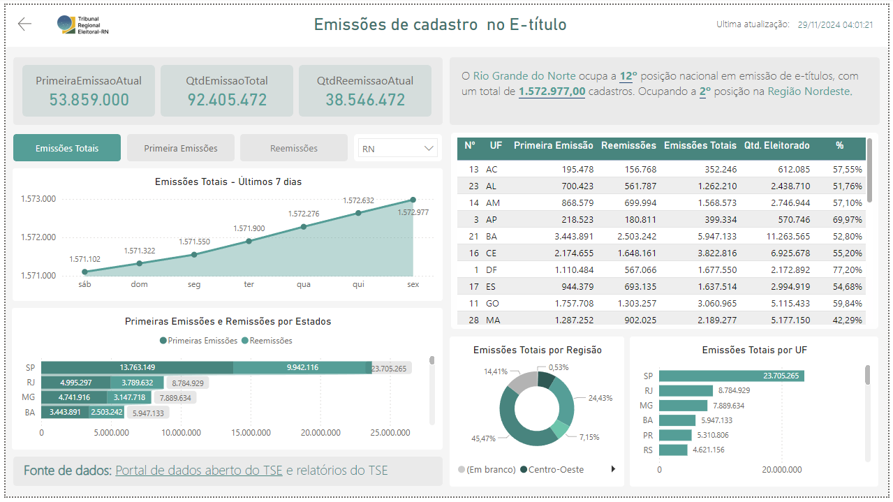

# BIETITULO: Visualizações de Dados

## Visão Geral

Este projeto tem como objetivo desenvolver um dashboard de acompanhamento de emissões de cadastros no aplicativo do etitulo, é um aplicativo móvel para obtenção da via digital do título de eleitor.
A ferramenta de visualização utilizada é o **Power BI**, que extrai os dados da camada 3 do datalake do TRE-RN.

---

## Sobre as Visualizações

As visualizações são criadas para ajudar na análise e tomada de decisões com base nos dados processados.
A ferramenta utilizada para criação dos dashboards é o **Power BI**.
A visualização é dividida em duas paginas, a capa e as informações gerais do etitulo.

### Capa

Esta pagina é uma apresentação do painel, e contém alguns elementos graficos. Seu propósito é apresentar uma descrição reduzida do painel, mostrar a última data de atualização e a autoria do desenvolvimento.


#### Visuais:
- **Indicador - Data de atualização**: Ao lado do botão tem um cartão que apresenta a data de atualização dos dados
- **Botão**: Único botão na tela, ele leva a página principal do painel


### Geral e-Título

Este painel do Power BI apresenta uma visualização geral dos dados em relação as primeiras emissões, reemissões e total de emissões para cada estado do Brasil. Além disso permite ver um histórico das emissões dos últimos 7 dias.



#### Visuais:
- **Indicador - Primeiras emissões**: Indicador apresentando o total selecionado de primeiras emissões.
- **Indicador - Reemissões**: Indicador apresentando o total selecionado de reemisões.
- **Indicador - Total de emissões**: Indicador apresentando o total selecionado das emissões. Esse valor representa a soma das primeiras emissões e reemissões.
- **Gráficos de linha - Primeiras Emissões/Reemissões/Total de Emissões**: Existem três botões na parte superior do painel. Esses botões alternam a visibilidade dos gráficos de linha, em que cada gráfico mostra os últimos 7 dias de um dos tipos de emissões.
- **Gráfico de coluna - Primeiras Emissões e Reemissões por Estado**: Gráfico de coluna horizontal mostrando a quantidade de primeiras emissões e reemissões por estado.
- **Tabela - Quantitativo de Emissões e Eleitorado**: Tabela que mostra uma visão geral dos quantitativos de emissões e do eleitorado. Além disso, exibe o % da quantidade de emissões em relação ao eleitorado.
- **Gráficos Rosca -  Emissões totais por região**: Gráfico rosca dividindo os quantitativos de emissões por região.
- **Gráfico de coluna -  % Emissões por UF**: Gráfico apresenta a % de Emissões (Emissões Totais/eleitorado do estado) por UF

---

## Sobre os Dados

Os dados utilizados para criação dos gráficos são retirados do DataLake, a partir das tabelas:

<details>
<summary>etitulo.etitulo.etitulo</summary>

| Campo                      | Descrição                                                            | Tipo       | Exemplo                        |
|----------------------------|----------------------------------------------------------------------|------------|--------------------------------|
| **UF**                     | UF                                                                   | timestamp  | RN                             |
| **QTDE_PRIMEIRA_EMISSAO**  | Quantidade das primeiras emissões                                    | inteiro    | 887110                         |
| **QTDE_REMISSAO**          | Quantidade das reemissões                                            | inteiro    | 2541                           |
| **QTDE_EMISSAO**           | Quantidade das emissões                                              | inteiro    | 42232                          |
| **DATA_RASPAGEM**          | Data atualizações dos dados                                          | timestamp  | 2024-09-14 04:00:00+00:00      |
| **DATA_OBJETO**            | Data atualizações dos dados                                          | timestamp  | 2024-09-14 04:00:00+00:00      |
| **SG_UF**                  | UF                                                                   | string     | CO                             |
| **QT_ELEITORES_PERFIL**    | Quantidade Eleitores                                                 | inteiro    | 42232                          |
| **EXTRAIDO_EM**            | Data atualizações dos dados                                          | timestamp  | 2024-09-14 04:00:00+00:00      |
| **regiao_nome**            | Região do estado                                                     | string     | Centro-Oeste                   |
| **uf_brlocalidades**       | UF                                                                   | string     | RJ                             |
| **populacao_total**        | População total do estado                                            | inteiro    | 12223                          |

</details>

---
## Medidas

<details>
<summary>Medidas</summary>

PrimeiraEmissaoAtual - Quantidade de primeiras emissões considerando a ultima data (Existem varias duplicatas dos dados na tabela, então é necessário selecionar somente a última)
```DAX
CALCULATE(
    SUM('etitulo etitulo'[QTDE_PRIMEIRA_EMISSAO]),
    'etitulo etitulo'[DATA_OBJETO]=max('etitulo etitulo'[DATA_OBJETO])
)
```

QtdReemissõesAtual - Quantidade de reemissões considerando a última data.
```DAX
CALCULATE(
    SUM('etitulo etitulo'[QTDE_REMISSAO]),
    'etitulo etitulo'[DATA_OBJETO]=max('etitulo etitulo'[DATA_OBJETO])
)
```

QtdEmissõesTotais - Quantidade de emissões totais considerando ultima data
```DAX
CALCULATE(
    SUM('etitulo etitulo'[QTDE_EMISSAO]),
    'etitulo etitulo'[DATA_OBJETO]=max('etitulo etitulo'[DATA_OBJETO])
)
```

% Emissões por Eleitorado
```DAX
VAR totalEleitores = CALCULATE(
    SUM('etitulo etitulo'[QT_ELEITORES_PERFIL]),
    'etitulo etitulo'[DATA_OBJETO]=max('etitulo etitulo'[DATA_OBJETO])
)

VAR totalEmissoes = [QtdEmissaoTotal]

RETURN DIVIDE(totalEmissoes,totalEleitores)
```

Qtd. Eleitorado
```DAX
CALCULATE(
    SUM('etitulo etitulo'[QT_ELEITORES_PERFIL]),
    'etitulo etitulo'[DATA_OBJETO]=max('etitulo etitulo'[DATA_OBJETO])
)
```

Rank % Emissões
```DAX
RANKX(
    ALL('etitulo etitulo'[UF]),
    [% Emissoes por Eleitorado],
    ,DESC,
    Skip
)
```

Rank % Emissões RN
```DAX
CALCULATE(
    [Rank % Emissões],
    'etitulo etitulo'[UF]="RN"
)
```

QtdEmissãoTotalRN
```DAX
CALCULATE(
    SUM('etitulo etitulo'[QTDE_EMISSAO]),
    'etitulo etitulo'[DATA_OBJETO]=max('etitulo etitulo'[DATA_OBJETO]),
    'etitulo etitulo'[UF]="RN"
)
```

Rank % Emissões RN Nordeste
```DAX
CALCULATE(
    [Rank % Emissões],
    'etitulo etitulo'[UF]="RN",
    'etitulo etitulo'[regiao_nome]="Nordeste"
)
```
</details>


--
## Requisitos

- **Power BI**: Para criação das visualizações.
---

<!-- ## Instruções de Instalação

1. Clone o repositório:

```bash
git clone https://gitlab.com/seu-usuario/projeto-etl-visualizacoes.git
cd projeto-etl-visualizacoes -->